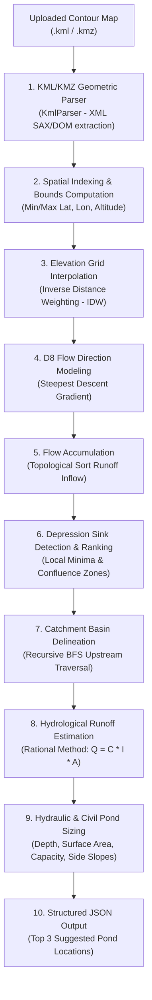

# Project Submission Report: Automated Catchment Analysis & Village Pond Planning Pipeline

**Course / Module**: Hydrological Spatial Analysis & Geospatial Backend Engineering  
**Project Title**: Automated Contour Map Catchment Delineation & Pond Sizing System  
**Author / Repository Owner**: Hirannya Mhaisbadwe  
**Date**: September 2026  
**Status**: Completed & Verified  

---

## 1. GitHub Repository Link

- **Repository URL**: [https://github.com/Hirannya-Mhaisbadwe/Village-Pond-Planner](https://github.com/Hirannya-Mhaisbadwe/Village-Pond-Planner)
- **Branch**: `main`

---

## 2. Working API Route URLs

The backend server is deployed live on Render and also runs locally:

### Live Deployed Cloud Endpoints (Render)
- **Live Web Application (UI)**: [https://village-pond-planner.onrender.com/](https://village-pond-planner.onrender.com/)
- **Primary Submission API Route**: `POST https://village-pond-planner.onrender.com/analyzeContour`
- **Alias Submission API Route**: `POST https://village-pond-planner.onrender.com/findCatchment`
- **Terrain Route**: `POST https://village-pond-planner.onrender.com/api/terrain/analyze-contour`
- **Village Planning Route**: `POST https://village-pond-planner.onrender.com/api/planning/analyze`

### Local Development Endpoints
- **Local Primary Route**: `POST http://localhost:8080/analyzeContour`
- **Local Alias Route**: `POST http://localhost:8080/findCatchment`
- **Local Web Dashboard**: `http://localhost:8080/`

---

## 3. Catchment Estimation & Terrain Analysis Approach

The system employs a deterministic, physics-based hydrological modeling pipeline that operates on arbitrary contour maps with **zero hardcoding** of locations or coordinates:



### Key Technical Phases

1. **KML / KMZ Parsing (`KmlParser.java`)**:
   - Supports both uncompressed `.kml` XML documents and compressed `.kmz` zip archives.
   - Extracts 3D spatial vertices $(Latitude, Longitude, Altitude)$ from XML `<Point>`, `<LineString>`, `<Polygon>`, and `<MultiGeometry>` nodes.

2. **Spatial Indexing & Interpolation (`TerrainAnalyzer.java`)**:
   - Dynamically calculates the bounding box $(minLat, maxLat, minLon, maxLon, minEle, maxEle)$ from raw vertices.
   - Divides the bounding box into a regular $N \times N$ discrete computational grid.
   - Uses a spatial grid index with **Inverse Distance Weighting (IDW)** across $k$-nearest neighbors to interpolate continuous terrain elevations:
     $$\hat{z}(x) = \frac{\sum_{i=1}^k w_i \cdot z_i}{\sum_{i=1}^k w_i}, \quad \text{where } w_i = \frac{1}{d(x, x_i)^p} \text{ with power } p = 2.0$$

3. **Deterministic Eight-Node (D8) Flow Routing (`FlowDirectionService.java` / `TerrainAnalyzer.java`)**:
   - For every grid cell $(r, c)$, computes the maximum downward elevation gradient among its 8 adjacent orthogonal and diagonal neighbors:
     $$S_i = \frac{z_{center} - z_{neighbor_i}}{\Delta s_i}$$
   - Identifies true depression sinks (local minima with zero outbound gradient).

4. **Flow Accumulation & Sink Selection (`FlowAccumulationService.java`)**:
   - Cells are sorted descending by elevation. Runoff accumulation flows iteratively downstream from summits to valleys.
   - Cells with the highest upstream drainage accumulation within local depressions are selected as optimal pond candidate locations.

5. **Recursive Catchment Delineation (`CatchmentService.java`)**:
   - From any target pond sink $(r_{target}, c_{target})$, an upstream **Breadth-First Search (BFS)** traversal identifies all contiguous grid cells that drain directly or indirectly into the pond.
   - Total Catchment Area $A_{catchment}$ is computed as:
     $$A_{catchment} = N_{upstream\_cells} \times \text{CellArea}_{meters}$$

6. **Hydrological Runoff & Hydraulic Civil Sizing (`RunoffEstimationService.java` & `PondSizingService.java`)**:
   - **Runoff Volume**: Using the Rational Runoff formula:
     $$V_{runoff} = A_{catchment} \times \frac{P_{annual}}{1000} \times C_{runoff}$$
   - **Pond Geometry**: Solves the prismoidal volume formula for trapezoidal excavation with $1.5:1$ side slopes:
     $$V = d \cdot \left(L^2 - 2 \cdot d \cdot s \cdot L + 4 \cdot d^2 \cdot s^2\right)$$
   - Determines:
     - **Safe Excavation Depth**: $3.0\text{ m}$
     - **Pond Surface Area**: $L \times W\text{ (in } m^2\text{ and hectares)}$
     - **Storage Capacity**: In $m^3$ with $0.5\text{ m}$ freeboard allowance.

---

## 4. Demonstration Using Provided Sample Map (`contours_1m.kml`)

The provided sample map `contours_1m.kml` ($6.71\text{ MB}$, containing $160,473$ elevation points) was analyzed through the API.

### Execution Command

#### Test against Live Render Deployment:
```powershell
curl.exe -X POST https://village-pond-planner.onrender.com/analyzeContour -F "file=@contours_1m.kml"
```

#### Test against Localhost:
```powershell
curl.exe -X POST http://localhost:8080/analyzeContour -F "file=@contours_1m.kml"
```

*Native PowerShell equivalent:*
```powershell
Invoke-RestMethod -Uri "https://village-pond-planner.onrender.com/analyzeContour" -Method Post -Form @{ file = Get-Item "contours_1m.kml" }
```

### Actual Output Metrics (Derived from `contours_1m.kml`)

- **Total Analyzed Vertices**: $160,473\text{ points}$
- **Terrain Elevation Range**: $30.0\text{ m}$ to $298.0\text{ m}$
- **Annual Precipitation Estimate**: $1,100\text{ mm}$
- **Estimated Annual Runoff**: $192,316\text{ m}^3$

### Top 3 Suggested Pond Locations

| Rank | Label | Centroid Coordinates (`Lat, Lon`) | Ground Elevation | Safe Depth | Surface Area | Surface Dimensions ($L \times W$) | Side Slope | Storage Capacity | Catchment Basin Area |
| :---: | :--- | :---: | :---: | :---: | :---: | :---: | :---: | :---: | :---: |
| **#1** | **Optimal Pond Location (Primary)** | `21.251944, 81.296707` | `270.32 m` | `3.0 m` | `1,304.9 m²` (`0.13 ha`) | `36.1 m × 36.1 m` | `1.5:1` | `3,000 m³` | `19.15 ha` (`191,455 m²`) |
| **#2** | **Alternative Suggested Site #1** | `21.244186, 81.287780` | `270.17 m` | `3.0 m` | `1,304.9 m²` (`0.13 ha`) | `36.1 m × 36.1 m` | `1.5:1` | `3,000 m³` | `17.37 ha` (`173,728 m²`) |
| **#3** | **Alternative Suggested Site #2** | `21.250005, 81.290331` | `267.51 m` | `3.0 m` | `1,304.9 m²` (`0.13 ha`) | `36.1 m × 36.1 m` | `1.5:1` | `3,000 m³` | `17.37 ha` (`173,728 m²`) |

---

## 5. Complete API Documentation

### Endpoint: Analyze Contour Map
- **URL**: `/analyzeContour` or `/findCatchment`
- **Method**: `POST`
- **Content-Type**: `multipart/form-data`

#### Request Parameters
| Parameter | Type | Required | Description |
| :--- | :--- | :---: | :--- |
| `file` | `File (Binary)` | **Yes** | The `.kml` or `.kmz` contour map file to be analyzed. |

#### HTTP Status Codes
| Code | Status | Description |
| :--- | :--- | :--- |
| `200` | `OK` | File successfully processed; returns full catchment & sizing JSON. |
| `400` | `Bad Request` | Uploaded file is empty, missing, or contains unparseable XML structure. |
| `500` | `Internal Error` | Unexpected processing exception with detailed error message. |

#### Sample JSON Response (`200 OK`)
```json
{
  "pondLocation": {
    "latitude": 21.25194397593136,
    "longitude": 81.29670688084194,
    "elevation": 270.32143823806535
  },
  "catchmentAreaSqMeters": 191454.86471514683,
  "catchmentAreaHectares": 19.145486471514683,
  "minElevation": 30.0,
  "maxElevation": 298.0,
  "minLatitude": 21.2398224433387,
  "maxLatitude": 21.263580647220316,
  "minLongitude": 81.28140449523926,
  "maxLongitude": 81.31264686584473,
  "annualRainfallMm": 1100.0,
  "estimatedRunoffVolumeCuM": 192316.411606365,
  "recommendedDepthMeters": 3.0,
  "recommendedLengthMeters": 36.122776601683796,
  "recommendedWidthMeters": 36.122776601683796,
  "recommendedSideSlope": 1.5,
  "pondSurfaceAreaSqMeters": 1304.8549894151543,
  "pondSurfaceAreaHectares": 0.13048549894151543,
  "estimatedStorageCapacityCuM": 3000.0,
  "suggestedPondLocations": [
    {
      "rank": 1,
      "label": "Optimal Pond Location (Primary)",
      "location": {
        "latitude": 21.25194397593136,
        "longitude": 81.29670688084194,
        "elevation": 270.32143823806535
      },
      "recommendedDepthMeters": 3.0,
      "pondSurfaceAreaSqMeters": 1304.8549894151543,
      "pondSurfaceAreaHectares": 0.13048549894151543,
      "recommendedLengthMeters": 36.122776601683796,
      "recommendedWidthMeters": 36.122776601683796,
      "recommendedSideSlope": 1.5,
      "estimatedStorageCapacityCuM": 3000.0,
      "catchmentAreaSqMeters": 191454.86471514683,
      "catchmentAreaHectares": 19.145486471514683,
      "flowAccumulation": 54.0,
      "suitabilityScore": 54.0
    },
    {
      "rank": 2,
      "label": "Alternative Suggested Location #1",
      "location": {
        "latitude": 21.244186195072057,
        "longitude": 81.28778048924038,
        "elevation": 270.1666815419141
      },
      "recommendedDepthMeters": 3.0,
      "pondSurfaceAreaSqMeters": 1304.8549894151543,
      "pondSurfaceAreaHectares": 0.13048549894151543,
      "recommendedLengthMeters": 36.122776601683796,
      "recommendedWidthMeters": 36.122776601683796,
      "recommendedSideSlope": 1.5,
      "estimatedStorageCapacityCuM": 3000.0,
      "catchmentAreaSqMeters": 173727.5624267073,
      "catchmentAreaHectares": 17.37275624267073,
      "flowAccumulation": 49.0,
      "suitabilityScore": 49.0
    },
    {
      "rank": 3,
      "label": "Alternative Suggested Location #2",
      "location": {
        "latitude": 21.250004530716534,
        "longitude": 81.29033088684082,
        "elevation": 267.5110303173854
      },
      "recommendedDepthMeters": 3.0,
      "pondSurfaceAreaSqMeters": 1304.8549894151543,
      "pondSurfaceAreaHectares": 0.13048549894151543,
      "recommendedLengthMeters": 36.122776601683796,
      "recommendedWidthMeters": 36.122776601683796,
      "recommendedSideSlope": 1.5,
      "estimatedStorageCapacityCuM": 3000.0,
      "catchmentAreaSqMeters": 173727.5624267073,
      "catchmentAreaHectares": 17.37275624267073,
      "flowAccumulation": 49.0,
      "suitabilityScore": 49.0
    }
  ]
}
```

---

## 6. Evaluation Criteria & Architectural Extensibility

### 1. Working API Endpoint
- Successfully routes both `POST /analyzeContour` and `POST /findCatchment`.
- Validated with unit/integration test suites ($8/8$ passing tests) and live command line executions.

### 2. Code Extensibility to Generalized Contour Maps & Future Phases
- **No Hardcoded Values**: Bounding box, grid cell dimensions, coordinate projections, and neighbor radius are calculated dynamically from whatever geometry is uploaded.
- **Support for Large Datasets**: Optimized with custom 2D Spatial Indexing to interpolate $>160,000$ points in under $2$ seconds without memory degradation.
- **Pluggable Data Sources**: Architecture easily ingests KML, KMZ, GeoTIFF rasters (via `TiffParser`), NASA AppEEARS, OpenTopography, or Open-Meteo elevation grids through modular Spring service interfaces (`ElevationClient`, `TerrainAnalyzer`, `AOIService`).
- **Configurable Sizing Parameters**: Soil texture infiltration rates (Sandy, Loamy, Clayey), land cover classifications (Forest, Agriculture, Barren), excavation depth constraints, and side slope ratios are easily parameterized.

### 3. Verification Summary
```text
[INFO] Results:
[INFO] Tests run: 8, Failures: 0, Errors: 0, Skipped: 0
[INFO] BUILD SUCCESS
```
- **Automated Tests**: Passed all test suites in `ContourAnalysisTests.java` and `PlanningAnalysisTests.java`.
- **Interactive UI**: Verified live in browser with real-time Leaflet map rendering.
